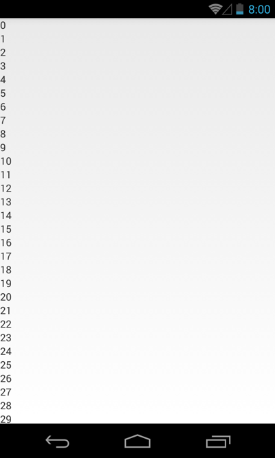
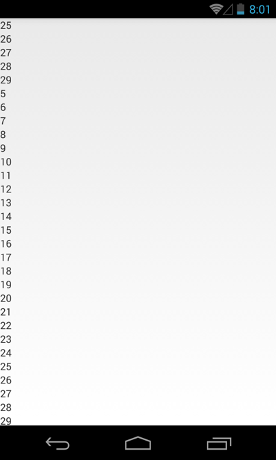

Steps to reproduce
------------------
This bug only occurs on Android 4.3. The sample app has the minimal requirements to trigger this bug. Simply install the app and swipe to refresh.

More details:

1. Place a `RecyclerView` in a `SwipeRefreshLayout`.
2. Hook up an `Adapter` that contains at least 6 items.
3. Set up the item view such that it has a `TextView` inside a `LinearLayout` inside another `LinearLayout`.
4. Call `notifyDataSetChanged()` on the adapter.

### What happens?
A subset of items from the bottom of the list (25-29 in the sample app on my Nexus 4) get redrawn at the top of the list.

### What should happen?
The list should remain unchanged after the refresh.

Screens
-------
 
